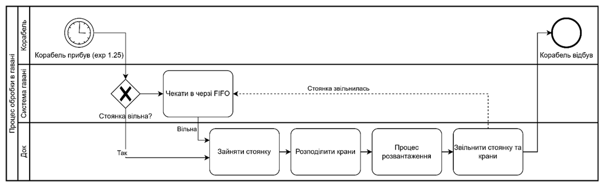
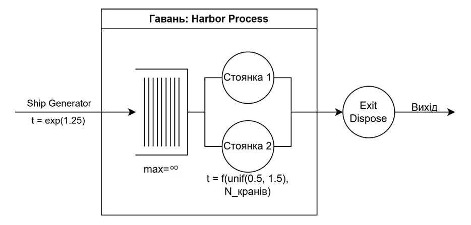
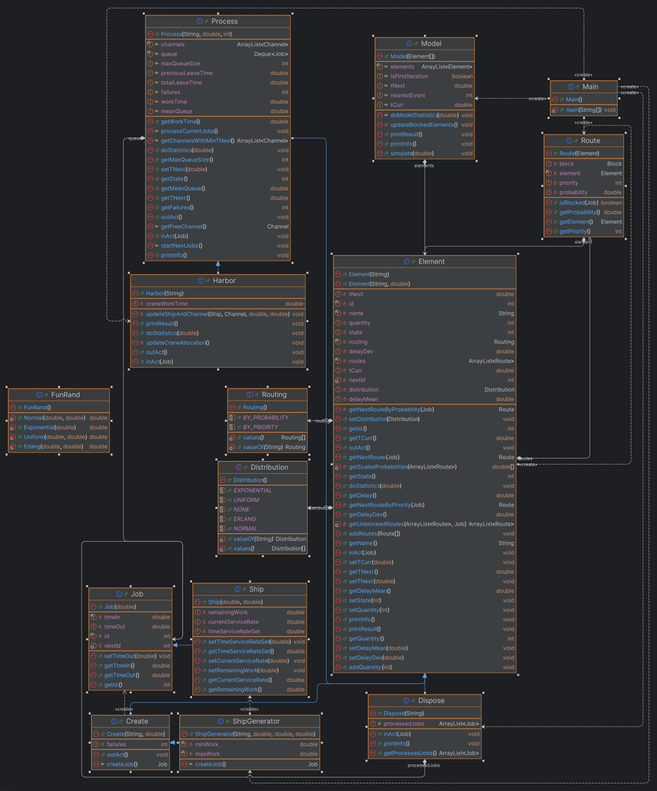
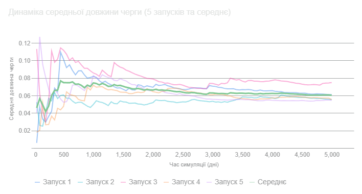
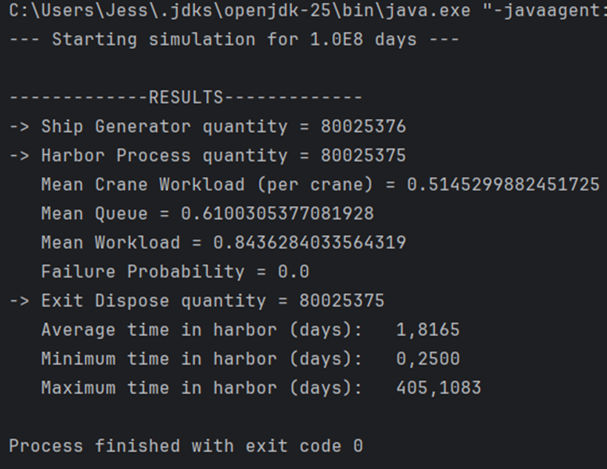

# Імітаційна модель системи розвантаження кораблів (Harbor Simulation Model)

Цей проєкт є програмною реалізацією імітаційної моделі системи розвантаження кораблів у гавані, розробленою в рамках курсової роботи з дисципліни "Моделювання систем" (Завдання А23).

Метою проєкту є дослідження ключових показників ефективності (KPI) порту, що має 2 якірні стоянки та 2 крани, з урахуванням складної логіки динамічного розподілу ресурсів.

- **Автор:** Малий Олександр Сергійович (ІП-24)
- **Мова:** Java (JDK 25)
- **Формалізм:** Мережа масового обслуговування (СМО)
- **Підхід:** Дискретно-подійне моделювання (принцип найближчої події)

---

## 1. Опис задачі (Завдання А23)

Система моделює гавань з **2 якірними стоянками** (каналами обслуговування) та **2 кранами** (спільними ресурсами).

- **Потік кораблів:** Кораблі прибувають із часом між надходженнями, розподіленим за **експоненціальним** законом із середнім **1.25 дня**.
- **Черга:** Якщо обидві стоянки зайняті, кораблі стають у необмежену чергу, що обслуговується за принципом **FIFO**.
- **Розвантаження:** Базовий час розвантаження одним краном розподілений за **рівномірним** законом між **0.5** та **1.5** днями.

### Ключова логіка (Динамічний розподіл кранів)

Унікальність моделі полягає в логіці спільного використання кранів:

1.  **Сценарій 1 (1 корабель):** Якщо в доці знаходиться лише один корабель, на його розвантаження направляються **обидва крани**, і час розвантаження, що залишився, **зменшується вдвічі**.
2.  **Сценарій 2 (2 кораблі):** Якщо в доці знаходяться два кораблі, кожен обслуговується **одним краном**.
3.  **Перерозподіл (Прибуття):** Якщо прибуває 2-й корабель (поки 1-й розвантажувався 2-ма кранами), один кран **негайно переходить** на новий корабель. Час, що залишився для 1-го корабля, **збільшується вдвічі**.
4.  **Перерозподіл (Відбуття):** Якщо один з двох кораблів завершує розвантаження, його кран **негайно переходить** на той, що залишився (який тепер обслуговується 2-ма кранами).

---

## 2. Концептуальна та Формалізована модель

Процес функціонування системи візуалізовано за допомогою BPMN-діаграми (рис. 1.1) для візуалізації потоку подій, та формалізований у вигляді мережі масового обслуговування (рис. 2.1).

---

## 3. Архітектура програмної реалізації

Проєкт реалізовано на Java з використанням об'єктно-орієнтованого підходу. В основі лежить універсальний "рушій" (`Element`, `Model`), який керує дискретно-подійним циклом.

Ключова логіка завдання інкапсульована у спеціалізованих класах:
- `ShipGenerator`: Наслідує `Create`, генерує об'єкти `Ship`.
- `Ship`: Наслідує `Job`, додає поля `remainingWork` та `currentServiceRate`.
- `Harbor`: Наслідує `Process`, містить ключовий алгоритм `updateCraneAllocation()` для динамічного розподілу кранів.

---

## 4. Результати експериментального дослідження

### 4.1. Визначення перехідного періоду (T = 2000 днів)

Було проведено 5 пробних запусків на 5000 днів для візуального аналізу виходу системи на сталий режим. Графік (рис 4.1) показує високу стохастичність, але стабілізацію середньої поведінки (товста лінія) **після ~2000 днів**.

### 4.2. Результати контрольного заміру (T_run = 1.0E8)

Проведено фінальний прогін моделі на загальний час `100,000,000.0` (1.0E8) днів для отримання статистично стійких результатів.

 

#### Ключові показники ефективності (KPI)

| Показник | Значення (з E8) | Інтерпретація |
| :--- | :--- | :--- |
| **Середнє завантаження 1 крана** | **~51.5%** | Кожен з двох кранів у середньому зайнятий трохи більше половини часу. |
| **Середня к-сть зайнятих стоянок**| **~0.844** | З 2-х доступних стоянок в середньому зайнято 0.844. |
| **Середня довжина черги** | **~0.610** судна | Система є стабільною. В середньому в черзі знаходиться менше 1 корабля. |
| **Середній час у гавані** | **~1.817** днів | Середній час корабля в системі (черга + розвантаження). |
| **Мін. час у гавані** | 0.25 днів | Теоретичний мінімум (0.5 дня / 2 крани). |
| **Макс. час у гавані** | ~405.1 днів | Демонструє високу стохастичність та ризик рідкісних заторів. |

---

## 5. Як запустити проєкт

Проєкт є стандартним Java-проєктом, розробленим у IntelliJ IDEA.

1.  Клонуйте репозиторій.
2.  Відкрийте проєкт у вашій IDE (напр., IntelliJ IDEA).
3.  Переконайтеся, що у вас налаштований JDK 25.
4.  Знайдіть та запустіть файл `Main.java`.
5.  Результати симуляції та статистика будуть виведені у консоль.

---
